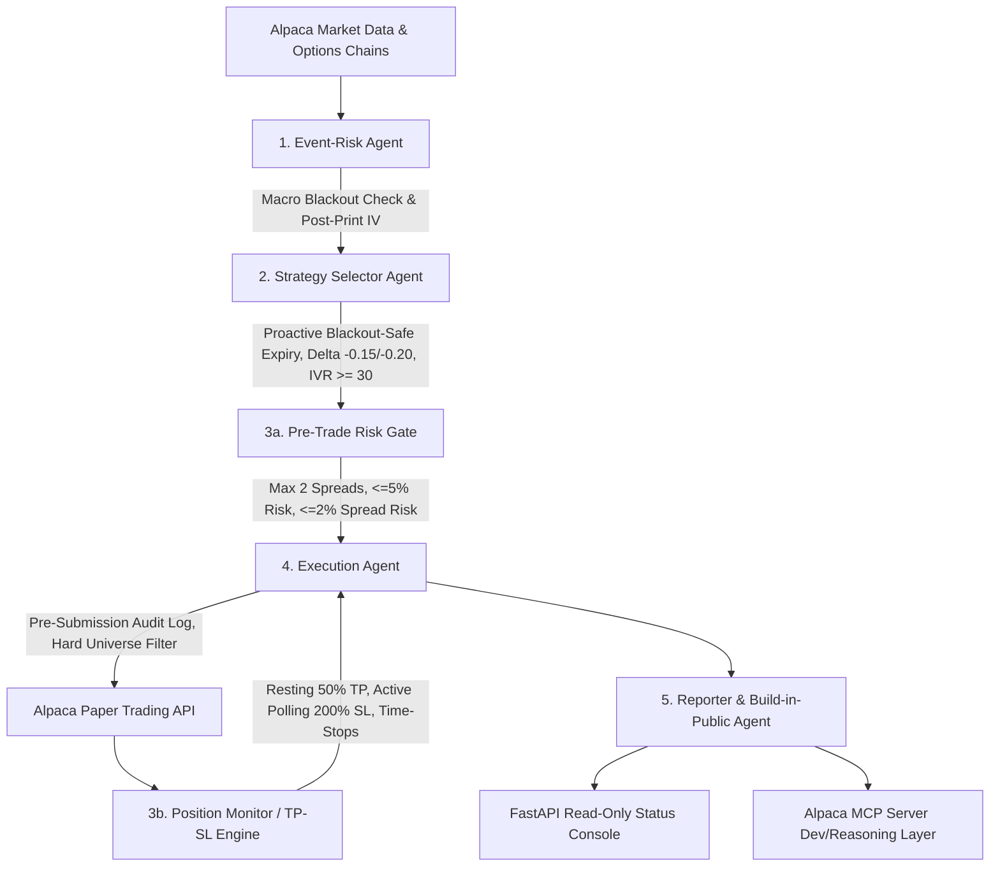

# 🛡️ ThetaGuard — Alpaca Income & Portfolio Overlay Agent

> **Alpaca AI Trading Agents Hackathon** (lablab.ai x Alpaca)  
> **Track**: Income & Portfolio Overlay Agents  
> **Build Window**: Aug 28 – Sep 4, 2026  
> **Stack**: Python 3.11+, LangGraph, FastAPI, Alpaca Trading SDK (Paper), Alpaca CLI, Alpaca MCP Server

---

## 📌 Executive Summary

**ThetaGuard** is a systematic, event-aware multi-agent options trading system running on **SPY** and **QQQ** paper accounts. It executes defined-risk **Put Credit Spreads** designed for a consistent, low-variance positive P&L curve across the 6-day build window.

Instead of all-or-nothing naked puts or directional bets, ThetaGuard employs an ensemble of 5 specialized agents to enforce strict capital caps, dynamically enumerate Mon/Wed/Fri expiries, avoid high-impact macro blackouts (**Sep 1 JOLTS**, **Sep 4 NFP**), and maintain a real-time pre-trade audit trail.

---

## 🏗️ Multi-Agent Architecture & Design



### Agent Roles & Guardrails

| Component | Class / Location | Responsibility & Hard Logic |
| :--- | :--- | :--- |
| **🛡️ Event-Risk Agent** | `EventRiskAgent` in `src/agents/event_risk.py` | Hard lockout on **Sep 1 JOLTS (10:00 AM ET)** and **Sep 4 NFP (8:30 AM ET)**. Forces position liquidation prior to blackout. Requires empirical post-release IV rank verification ($\ge 30.0$) before resuming. |
| **🎯 Strategy Selector** | `StrategySelectorAgent` in `src/agents/strategy_selector.py` | Enforces IV Rank floor $\ge 30.0$. Selects short put delta **-0.15 to -0.20**, long put **$5 lower**. **Proactively avoids** expiries crossing macro blackout windows. |
| **⚖️ Pre-Trade Risk Gate** | `PreTradeRiskGate` in `src/agents/risk_manager.py` | Sizing & concentration: max **2 concurrent spreads** (max 1 SPY, 1 QQQ). Total portfolio risk $\le 5\%$ equity, individual spread risk $\le 2\%$. Hard rejection on cap breach (no silent resizing). |
| **⏱️ Position Monitor** | `PositionMonitor` in `src/agents/risk_manager.py` | Active TP/SL Engine: resting **50% Take-Profit GTC limit** order upon fill; active **200% Stop-Loss polling monitor** (evaluated each daemon heartbeat); macro time-stops. |
| **⚡ Execution Agent** | `ExecutionAgent` in `src/agents/execution.py` | Hard code-level universe filter (rejects non-SPY/QQQ). Writes full reasoning to audit trail **before** order submission. Enforces `ALPACA_PAPER_TRADE=true`. |
| **📢 Reporter Agent** | `ReporterAgent` in `src/agents/reporter.py` | Compiles daily executive trade logs and drafts social updates tagging `@lablabai` and `@AlpacaHQ`. |

---

## 🔒 Production Heartbeat & Safety Design

1. **Single Production Loop**: The CLI runner (`python -m src.cli.runner daemon --interval 5`) is the single production loop. The FastAPI `/api/run-cycle` endpoint calls the exact same underlying `ThetaGuardEngine.run_cycle()` and is strictly protected behind `PUBLIC_READ_ONLY_MODE=True` with admin secret authorization to prevent unauthorized public execution.
2. **TP/SL Order Execution Model**:
   - **Take-Profit (50% max credit)**: Submitted as a resting GTC limit buy order immediately upon spread fill.
   - **Stop-Loss (200% credit loss / max loss breach)**: Evaluated dynamically via active polling in the daemon execution loop. When triggered, resting TP orders are cancelled and immediate market/limit buy-to-close orders are routed.
3. **Pre-Submission Audit Trail**: `ExecutionAgent` serializes the full decision justification into the persistent audit trail *before* dispatching network calls to Alpaca, guaranteeing an immutable trace for both filled and rejected orders.
4. **Data Provenance Transparency**: The client explicitly tracks and logs its data source (`[DATA SOURCE: ALPACA_LIVE_PAPER_API]` vs `[DATA SOURCE: DETERMINISTIC_SIMULATION_FALLBACK]`).

---

## 🚀 Quickstart & Usage

### 1. Clone & Install Dependencies

```bash
git clone https://github.com/your-username/ThetaGuard.git
cd ThetaGuard
pip install -r requirements.txt
```

### 2. Configure Environment

Copy `.env.example` to `.env` and configure your Alpaca Paper Trading keys:

```bash
cp .env.example .env
```

```env
ALPACA_API_KEY=your_alpaca_paper_api_key
ALPACA_SECRET_KEY=your_alpaca_paper_secret_key
ALPACA_PAPER_TRADE=true
IV_RANK_FLOOR=30.0
PUBLIC_READ_ONLY_MODE=true
```

### 3. Run Automated Tests

```bash
pytest tests/ -v
```

### 4. Run Pre-Kickoff Verification Scripts

```bash
# Tool 1: Inspect options chains, strike deltas, and data provenance
python scripts/inspect_chains.py

# Tool 2: Simulate NFP timeline (proactive expiry avoidance, pre-cutoff force-close, post-release IV verification)
python scripts/dry_run_nfp.py
```

### 5. Run CLI Production Daemon

```bash
# Run single cycle
python -m src.cli.runner cycle

# Run continuous production daemon (every 5 minutes)
python -m src.cli.runner daemon --interval 5

# View portfolio status
python -m src.cli.runner status
```

### 6. Launch Read-Only Web Console & MCP Server

```bash
# Launch Read-Only Dashboard
uvicorn src.api.main:app --host 0.0.0.0 --port 8000

# Launch Alpaca FastMCP Tool Server
python -m src.mcp.server
```

---

## 📋 Hackathon Compliance Checklist

- [x] **Defined-Risk Only**: Put credit spreads ($5 width), strictly no naked puts.
- [x] **Strict Universe**: SPY and QQQ only. Code-level guardrails block unauthorized symbols.
- [x] **Event-Aware Calendar**: Pre-event force closes on Sep 1 (JOLTS) and Sep 4 (NFP), post-print IV verification.
- [x] **Paper Trading Safety**: `ALPACA_PAPER_TRADE=true` enforced at runtime.
- [x] **Auditability**: Full pre-trade reasoning logs generated before every order.
- [x] **MCP Dev/Reasoning Layer**: FastMCP server integration.
- [x] **Build-in-Public Ready**: Social post drafting tagging `@lablabai` and `@AlpacaHQ`.
